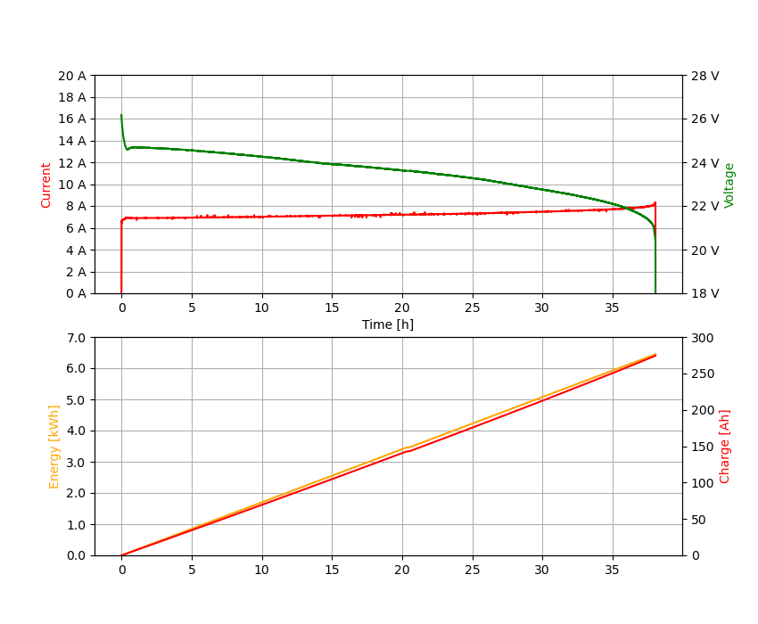

dl24-electronic-load
=====

Python library and CLI tools for DL24 electronic load device.

## Installation

It is recommended to set a virtual Python environment up before installing packages.

```shell
virtualenv env
source env/bin/activate

pip install -U git+https://github.com/KrystianD/dl24-electronic-load
```

## DL24 management

`tools.manage` module is used to send commands to the DL24 device over serial port link.

### Usage

```shell
# Read settings and measurements
dl24-manage -p /dev/ttyUSB0 read

# Set the parameters up and start
dl24-manage -p /dev/ttyUSB0 set-current 10
dl24-manage -p /dev/ttyUSB0 set-voltage-cutoff 10.7
dl24-manage -p /dev/ttyUSB0 enable
```

### Supported commands

| Command                        | Description                                |
|--------------------------------|--------------------------------------------|
| `set-current <amps>`           | set discharging current                    |
| `set-voltage-cutoff <voltage>` | set voltage at which discharging will stop |
| `set-timer <seconds>`          | set maximum discharging time               |
| `enable`                       | enable discharger                          |
| `disable`                      | disable discharger                         |
| `reset`                        | reset cumulative statistics                |
| `read -f [text,json]`          | read current settings and measurements     |

### Example

```shell
$ dl24-manage -p /dev/ttyUSB0 read -f json
{
  "enabled": true,
  "voltage": 11.809,
  "current": 9.999,
  "energy": 19.841,
  "charge": 238.5,
  "time": "01:59:03",
  "temperature": 35,
  "current_limit": 10.0,
  "voltage_cutoff": 10.7,
  "timer": "00:00:00"
}
```

## DL24 monitoring

`tools.monitor` module displays real-time discharging data and can save discharging charts.

### Usage

```shell
# View real time measurements
dl24-monitor -p /dev/ttyUSB0

# View real time measurements and save to test.csv file
dl24-monitor -p /dev/ttyUSB0 -o test.csv
dl24-monitor -p /dev/ttyUSB0 -o test.csv --append
```

### Example

```
$ dl24-monitor -p /dev/ttyUSB0
12.06 V | 10.00 A | 120.67 W |  91.30 Wh |  7.51 Ah | 0d 00:45:05 | 37 °C
```

## Charts plotting

`tools.plotter` module plots charts using matplotlib from the CSV file saved with `tools.monitor`.

#### Usage

```shell
python -m tools.plotter test.csv
```

#### Example


